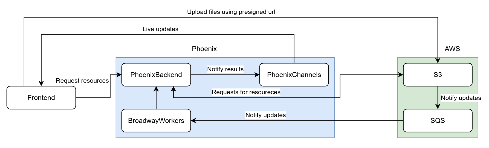

# Event based systems arquitecture

## Description
This project its an example of event driven system using background workers listening for messages in queue

## Diagram

## Explanation

### The back-ground
Basically the phoenix app has 2 workers, one listening for events in a general queue and the another for sqs messages 
related to s3 file events than just translates the message to something that can understeand the general message queue

Also, all notifications related to the messages must be deployed an notification to the frontend using PhoenixChannels

### The front-ground

The front requests to upload an a file to s3 and backend returns an a presigned url to handle the file upload directly
from the frontend and when an file its uploaded, s3 will add a message to an sqs queue and this message would be taken
by an BroadwayWorker and notify with PhoenixChannels to all the connected frontend clients

## Parts

- Backend: [`Phoenix`](https://www.phoenixframework.org/)
- Frontend: [`React.js`](https://reactjs.org/)
- AWS: [`Localstack`](https://localstack.cloud/)

## Requirements

- Maketool (Installed on Linux and MacOSX)
- Docker
